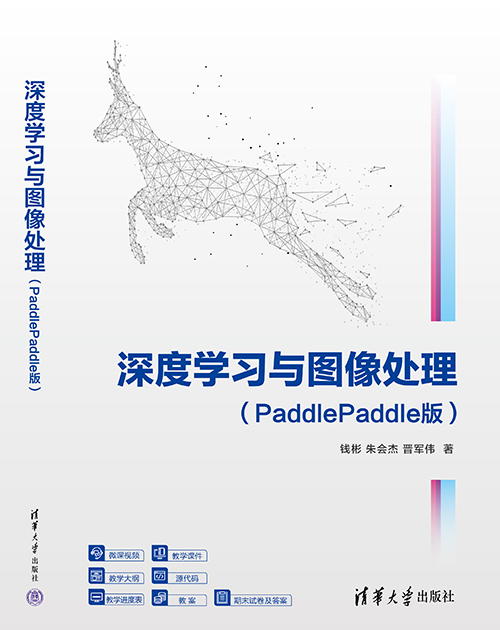

# 《深度学习与图像处理(PaddlePaddle版)》

  

**《深度学习与图像处理(PaddlePaddle版)**《深度学习与图像处理（PaddlePaddle版）》一书重点关注技术实践，面向自动驾驶、图像分类、目标检测、语义分割、示例分割、关键点检测、风格迁移等热门研究方向，与医学、工业等学科交叉融合，设计实践学习任务，真正实现理论与实践相结合AI人才培育目标，有益于人工智能学科及计算机视觉领域的发展。
该书同步配套：**微课视频、数据集和代码、教学课件、教学大纲、教学进度表、教案、期末试卷及答案**

## 🔥 最新动态

- 🔥**2024.10.1**🔥：新书上架
  - **💙 个人购买链接🔗：** [京东](https://item.jd.com/14830420.html)、[淘宝天猫](https://detail.tmall.com/item.htm?abbucket=13&id=846591473754&ns=1&pisk=fLdZKsmWjfhaeQGbGN54Tq26eWCOO1mS_IsfoEYc5GjGfEbcgHxjWGTmXnRVxEpsWtiTuPde4SNsXAL0gs1mV0GSNFQOMsmSOazi3lQ5PicfjN2nfyfqO0GSNFHGWsTnVCZ0BzbRPSfcItXhtMQasSxcnWYhvZQ0jZVi827AxNbGjtf3-Z_0sZx0iw2hPN7gi5jgxWbRxifcijS2SEVFPO0R5Lf695VNIgYGjFTytx6TBFsUa7AeLTjuNMP0iB7MROYBr7kfqLI1FiKnO552-Z-FFdoz_n8DyKXegl06qEJeD1OnoRjkCh6219rgIa5NbTAGKPPMWtveT1OiD8LB8GXPOpMKft1wbLIRIvnp0eS6mCW3bDsXFeOGL3mQTnB2nC1HsDcP4VZA-QIXMdr03Obd8ggE8LY4DHpvTnITH-BhwwSS5NwYHObd8ggE8-eAKMQFVV_1.&priceTId=213e36d617319871149618301e46a5&skuId=5795852886686&utparam=%7B%22aplus_abtest%22%3A%22833bd07cac09b0de8d85d712c8e276e9%22%7D&xxc=taobaoSearch)、[当当](http://product.dangdang.com/29800280.html)
  - **👩‍🏫 学校教材批量购买链接🔗：** [清华出版社](https://www.tup.tsinghua.edu.cn/booksCenter/book_09607601.html)

## 📚 本书特色
为解决深度学习与图像处理在教育教学中的实际问题，结合团队的项目开发经验，《深度学习与图像处理（PaddlePaddle版）》重点关注技术应用和产品落地，从内容上实现计算机视觉领域的热门方向全覆盖，从案例设计上关注从原理到实践的全流程，包含了云边端部署教程，并在百度飞桨星河社区平台开设配套课程，借由平台配齐教学资源和计算资源。本书特色如下。
* 1. 内容丰富全面
包含了传统的图像数据技术基础以及计算机视觉热门的目标分类、目标检测、语义分割、关键点检测、图像生成等研究内容，满足工业、教育、医疗、游戏等大部分场景需求。每个研究方向提供多种算法，只需要简单设置就能随意切换算法，更改网络结构，内容丰富多样。
* 2. 全流程覆盖
每个案例都覆盖原理讲解、数据标注、数据集制作、网络配置与训练、网络评估与可视化、静态网络导出、前端界面开发、推理库开发等内容，注重理论学习与上机实操相结合，循序渐进掌握深度学习开发，实现从小白到大师的晋级之路，无论是理论学习还是工程开发，都能从中收获颇多。
* 3. 云边端部署全覆盖
部署案例包括了云边端三种类型教程，云侧通过网页端访问服务器端部署，边侧计算通过工控机的方式分别提供了C#和QT部署案例，端侧提供了树莓派、Jetson系列和安卓的部署案例，部署场景代表性强、环境丰富。不需要从零开始学习C++、C#、HTML等语言，只需了解部署相关内容即可上手，大幅降低工程开发的难度和成本。
* 4. 超全配套资源
全书每个章节都分别提供了微课视频、源代码、教学课件、教学大纲、教学进度表、教案、期末考试试卷及答案等配套资源，多维度满足学习、教学以及工程开发需求。
* 5. 免费计算资源
本课程在飞桨官方星河社区开设有公开课，提供免费GPU资源进行学习和开发，只需要简单的网页端操作即可完成，每个章节还提供了已经配置好的开发环境，大幅降低了学习成本。

## ⭐ 配套资源（数据集和代码）
本书基于国产开源深度学习框架PaddlePaddle进行编写，全面、系统地介绍了PaddlePaddle在数字图像处理中的各种技术及应用。全书共8章，分别介绍了基于深度学习的图像分类、目标检测、语义分割、实例分割、关键点检测、风格迁移等内容，所有知识点均通过实际项目进行串联，旨在帮助读者掌握基本深度学习算法原理的基础上，扩展项目实操能力，起到学以致用的效果。

* **第1章** 图像处理基础：
[资源链接](https://aistudio.baidu.com/datasetdetail/253430)

* **第2章** 深度学习基础：
[资源链接](https://aistudio.baidu.com/datasetdetail/252154)

* **第3章** 图像分类（智能垃圾分拣器）：
[资源链接](https://aistudio.baidu.com/datasetdetail/251514)

* **第4章** 目标检测（二维码扫码枪）：
[资源链接](https://aistudio.baidu.com/datasetdetail/103078)

* **第5章** 语义分割（证件照制作工具）：
[资源链接](https://aistudio.baidu.com/datasetdetail/253252)

* **第6章** 实例分割（肾小球影像分析仪）：
[资源链接](https://aistudio.baidu.com/datasetdetail/240620)

* **第7章** 关键点检测（身份证识读APP）：
[资源链接](https://aistudio.baidu.com/datasetdetail/237276)

* **第8章** 风格迁移（照片动漫化在线转换网站）：
[资源链接](https://aistudio.baidu.com/datasetdetail/244532)

## 🧙‍♂️ 欢迎交流
* **书籍相关技术问题探讨**：
扫描二维码加入本书QQ群**820106877**，获得更高效的问题答疑，与各行业开发者交流讨论，期待您的加入！

  

* **项目合作**：
项目咨询或合作请添加祝老师微信 **xiaobenbenplus**，添加时请填写备注信息：**来自图书推荐**！

  

